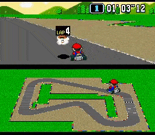

# Playing MarioKart in Real-Time

Magalie ANDORFER-HIRSCH
Rian TOUCHENT

This is our project for the course Deep Learning and Computer Vision at CentraleSupélec - 2022


   

# Usage

The easiest way is using conda

```bash
conda env create -f environment.yml
conda activate retro
```

you will then need to add gym-snes to retro.

```bash
git clone git@github.com:esteveste/gym-SuperMarioKart-Snes.git
```

You then need to copy the folder SuperMarioKart-Snes into site-packages/retro/data/stable/SuperMarioKart-Snes as explained in the repo above. Something like this :

```bash
cp -r gym-SuperMarioKart-Snes/SuperMarioKart-Snes /home/user/miniconda3/envs/env_name/lib/python3.7/site-packages/retro/data/stable/.
```

### Checkpoints and datasets

You will find checkpoints for neural networks and ppo and both datasets here :

https://drive.google.com/drive/folders/1XYGuxIS7BjXN85jh1TAXpFq94FG9I00V?usp=sharing

You simply need to extracts the zip files at the root of this project.

### Training

To train one of the Neural Networks models :

```bash
python train.py
```

To train ppo :

```bash
python train_ppo.py
```

### Running


To play a game with ppo :

```bash
python play.py
```

To play a game with NN :

```bash
python play_nn.py
```